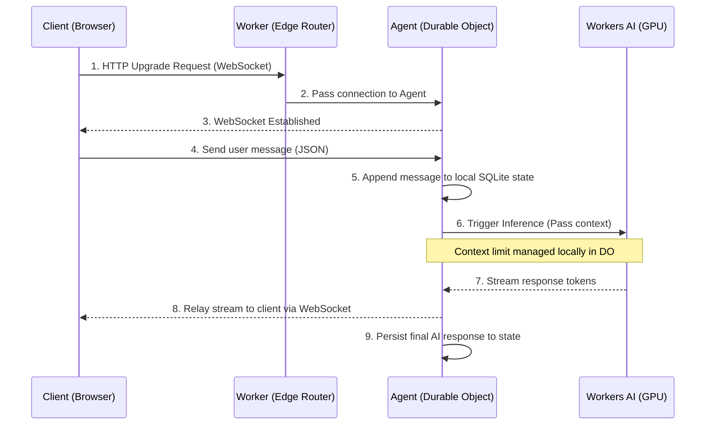
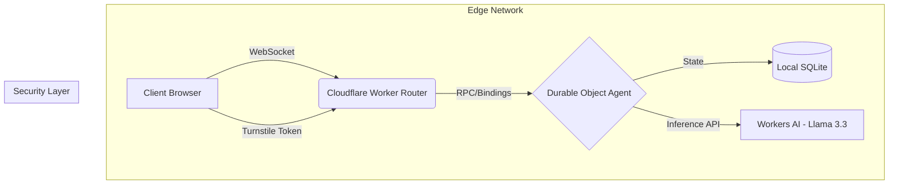

# Stateful Edge AI Assistant

This repository implements a highly-available, low-latency AI chat agent deployed entirely on the Cloudflare network. It demonstrates edge-native state management, real-time bidirectional communication, and localized AI inference without relying on centralized cloud providers (like AWS or GCP).

Link to Product: [here](https://main.cf-ai-chatbot-frontend-axh.pages.dev/)

## Architecture

The system is built on four core Cloudflare primitives:
1. **Cloudflare Pages:** Hosts the static frontend assets (HTML/CSS/JS).
2. **Cloudflare Workers:** Acts as the stateless routing layer and WebSocket upgrade handler at the network edge.
3. **Cloudflare Durable Objects (via Agents SDK):** Provides a single-point-of-coordination and strongly consistent SQLite-backed memory for conversation state.
4. **Workers AI:** Executes inference using `Llama 3.3 70B` on GPUs distributed across Cloudflare's edge network.

### System Flow & State Synchronization



### Component Breakdown



## Technical Decisions

* **Why Durable Objects over KV/D1?** 
  Conversation history requires strict read-after-write consistency. Using a stateless Worker with KV introduces race conditions and high latency (fetching entire history per message). Durable Objects keep the state in memory for active connections and persist asynchronously to a local SQLite instance, ensuring sub-millisecond state access.
* **Why WebSockets over HTTP Polling?**
  LLM inference with 70B parameter models can have high Time-To-First-Token (TTFT). WebSockets eliminate connection overhead for subsequent messages and allow us to stream tokens directly to the client UI, significantly improving perceived performance (UX).
* **Why the Agents SDK?**
  Abstracts away the boilerplate of Durable Object WebSocket handling, state hibernation, and lifecycle management, allowing us to focus purely on the agent's logic.

## Local Development

Ensure you have Node.js and Wrangler CLI installed.

```bash
# Install dependencies
npm install

# Run the local simulator (Worker + Durable Object + Local AI Stub)
npm run dev
```

## Deployment

This project requires a Cloudflare account with Workers Paid (for Durable Object access).

```bash
# 1. Deploy the backend (Worker + Durable Object)
npx wrangler deploy

# 2. Deploy the frontend
npx wrangler pages deploy public --project-name=cf-ai-chatbot-frontend
```

## Features Implemented
- [x] Strongly consistent conversation memory.
- [x] Edge-localized AI inference.
- [x] Real-time token streaming (In Progress).
- [ ] WebSocket integration for persistent connections (In Progress).
- [ ] Markdown parsing & syntax highlighting (In Progress).
- [ ] Turnstile Bot Protection (In Progress).
